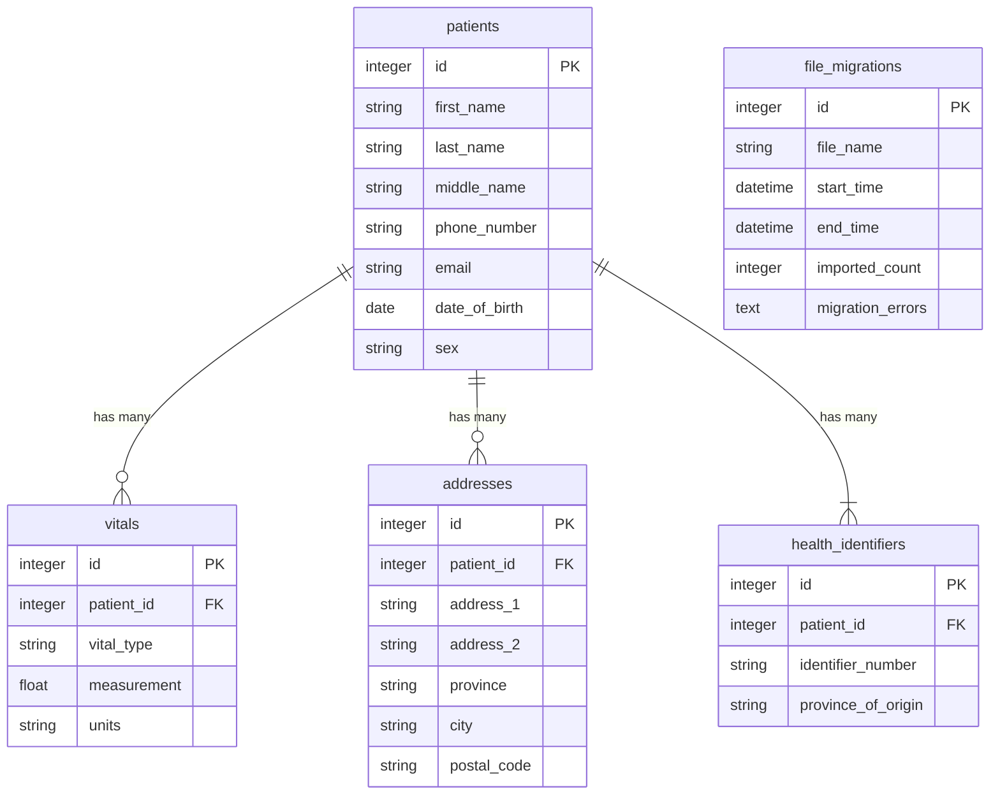
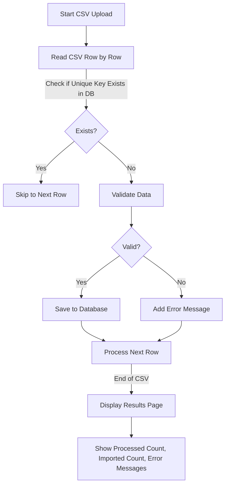

# Plan

## Database Schema

### patients

| Field Name    | Nullable | Default Value | Reason                                               |
| ------------- | -------- | ------------- | ---------------------------------------------------- |
| id            | false    | \-            | Primary key, unique identifier                       |
| first_name    | false    | \-            | Essential for patient identification                 |
| last_name     | false    | \-            | Essential for patient identification                 |
| middle_name   | true     | null          | Middle name is not mandatory                         |
| phone_number  | false    | \-            | Required for regular follow-ups                      |
| email         | true     | \-            | Some patients, especially elderly, may not use email |
| date_of_birth | false    | \-            | Important for medical information                    |
| sex           | false    | \-            | Important for medical information                    |

### addresses

| Field Name  | Nullable | Default Value | Reason                                                 |
| ----------- | -------- | ------------- | ------------------------------------------------------ |
| id          | false    | \-            | Primary key, unique identifier                         |
| patient_id  | false    | \-            | Foreign key, necessary for patient association         |
| address_1   | true     | null          | Flexibility for multiple locations and online services |
| address_2   | true     | null          | Supplementary address information                      |
| province    | true     | null          | Flexibility for multiple locations and online services |
| city        | true     | null          | Flexibility for multiple locations and online services |
| postal_code | true     | null          | Flexibility for multiple locations and online services |

### health_identifiers

| Field Name         | Nullable | Default Value | Reason                                             |
| ------------------ | -------- | ------------- | -------------------------------------------------- |
| id                 | false    | \-            | Primary key, unique identifier                     |
| patient_id         | false    | \-            | Foreign key, necessary for patient association     |
| identifier_number  | false    | \-            | Essential health identifier                        |
| province_of_origin | false    | \-            | Necessary for health identifier origin information |

### vitals

| Field Name  | Nullable | Default Value | Reason                                                  |
| ----------- | -------- | ------------- | ------------------------------------------------------- |
| id          | false    | \-            | Primary key, unique identifier                          |
| patient_id  | false    | \-            | Foreign key, necessary for patient association          |
| vital_type  | false    | \-            | Essential for identifying the type of vital information |
| measurement | false    | \-            | Essential measurement value                             |
| units       | false    | \-            | Essential measurement units                             |

### file_migrations

| Field Name       | Nullable | Default Value | Reason                           |
| ---------------- | -------- | ------------- | -------------------------------- |
| id               | false    | \-            | Primary key, unique identifier   |
| file_name        | false    | \-            | Essential file name              |
| start_time       | false    | \-            | Essential migration start time   |
| end_time         | true     | null          | Migration may not be completed   |
| imported_count   | false    | 0             | Initial value set to 0           |
| migration_errors | true     | null          | Errors may not always be present |

## User Story and Data Flow

## Migration Details

- Show imported count and error messages
  - To make it easy for users to fix data

## Data Processing

- Use Active Job

  - Pros:
    - Asynchronous processing allows background execution without blocking user interactions.
    - Automatic retries enhance reliability. (Optional)
  - Cons:
    - Potential delays with high job volumes.
    - Complex error handling for frequent job failures.

- Use Transactions

  - Pros:
    - Ensures data integrity by allowing all operations to succeed or fail as a unit.
    - Simplifies error handling with easy rollback.
  - Cons:
    - Long transactions can cause database locks, impacting performance.
    - Complex logic may reduce code readability.

## Future Improvement

- Creating unit/integration tests using auto-testing frameworks like RSpec
- Checking file size when uploading
- Handling System Failures During Transactions
  - Log error details for troubleshooting.
  - Implement mechanisms for resuming or retrying migrations without data loss.
  - Provide user feedback on upload status and errors for data correction.
